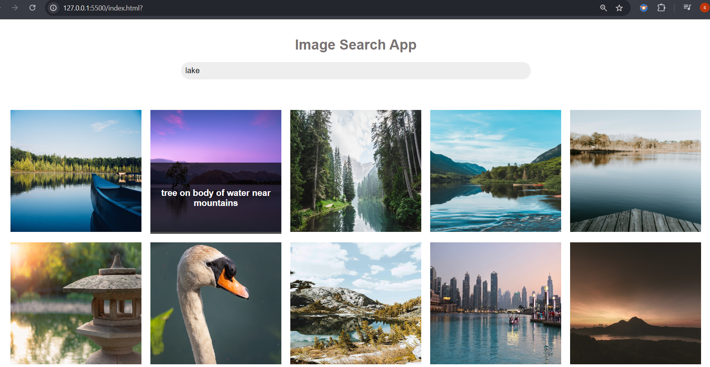

# ImageSearchApp

This is a simple web application that allows users to search for images using the Unsplash API. Users can enter a search term to find images related to their query and load more images as needed.

Features
Search for Images: Users can enter a keyword to search for related images from Unsplash.
Display Images: Images related to the search query are displayed in a grid format.
Load More Images: Users can load more images by clicking the "Load More" button.
Image Overlays: Each image displays a description overlay.
Technologies Used
HTML
CSS
JavaScript
Setup and Usage
Prerequisites
Obtain an API key from Unsplash Developers by signing up and creating a new application.
Installation
Clone this repository to your local machine:
